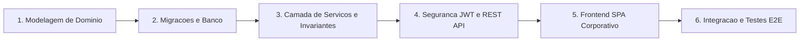

# Sistema de Gestao de Academia — Arquitetura Corporativa e Controle de Acesso

[](https://www.oracle.com/java/)
[](https://spring.io/projects/spring-boot)
[](https://react.dev/)
[](https://jwt.io/)
[]()

> Solucao empresarial completa para gestao operacional, financeira e de acesso fisico para redes de academias. Desenvolvido com foco em alta confiabilidade, seguranca transacional, integridade de dados e conformidade contabil.

---

## 1. Sumario Executivo

O **Sistema de Gestao de Academia** e uma plataforma corporativa desenvolvida para resolver problemas criticos na operacao de academias de medio e grande porte:

1. **Controle de Acesso Fisico Anti-Fraude**: Validacao em tempo real de hardware de catracas com bloqueio instantaneo de inadimplentes e acessos fora de horario.
2. **Prevencao de Overbooking e Concorrencia**: Controle transacional de capacidade maxima por sala em diarias e mensalidades.
3. **Gestao Financeira e DRE Consolidado**: Apuracao contabil em tempo real do Demonstrativo do Resultado do Exercicio (Receitas de planos + Vendas de balcao − Despesas operacionais).
4. **Ciclo de Vida de Agendamentos**: Rotina automatizada de expiracao de reservas preliminares nao pagas no prazo legal de 5 dias uteis com estorno transacional.

---

## 2. Decisoes de Arquitetura e Engenharia (Trade-offs e Racional)

Ao desenhar a solucao, priorizou-se manutenibilidade, isolamento de dominio e performance. Abaixo estao detalhadas as decisoes tecnicas adotadas e seus respectivos embasamentos:

### 2.1 Backend: Java 21 LTS e Spring Boot 3.3.4
* **Decisao**: Utilizar a versao Java 21 LTS aliada ao Spring Boot 3.x com Spring Data JPA e Hibernate 6.
* **Racional**:
  * **Confiabilidade Empresarial**: Ecossistema maduro com suporte nativo a transacoes ACID (`@Transactional`), injecao de dependencia e ecossistema consolidado de seguranca.
  * **Tipagem Estrita e Records**: Uso de `Records` do Java moderno para DTOs imutaveis, garantindo que dados trafegados entre camadas nao sofram mutacoes colaterais.
  * **Compatibilidade com Virtual Threads (Project Loom)**: Preparado para escalabilidade de I/O nao bloqueante em conexoes de catracas e consultas analiticas.

### 2.2 Arquitetura em Camadas (Layered Clean Architecture)
* **Decisao**: Separacao explicita entre **Dominio** (`br.com.academia.domain`), **Repositorios** (`br.com.academia.repository`), **Servicos de Negocio** (`br.com.academia.service`), **Infraestrutura/Seguranca** (`br.com.academia.infra`) e **Camada Web/DTOs** (`br.com.academia.web`).
* **Racional**:
  * **Isolamento de Regras de Negocio**: Toda a logica de precificacao, verificacao de catraca e fechamento de DRE reside na camada de servico (`@Service`), nunca em controllers.
  * **Desacoplamento de Frameworks nas Entidades**: Entidades JPA representam puramente o modelo relacional de negocio.

```
br.com.academia/
├── domain/                  # Entidades JPA (Usuario, Sala, Agendamento, RegistroCatraca, etc.)
│   └── enums/               # Enums de dominio (Role, StatusAgendamento, TipoEvento, etc.)
├── service/                 # Regras de negocio e casos de uso (AgendamentoService, CatracaService, etc.)
├── repository/              # Spring Data JPA Repositories
├── web/
│   ├── controller/          # REST Controllers com OpenAPI / Swagger 3
│   └── dto/                 # DTOs de entrada/saida (Java Records)
└── infra/
    ├── security/            # Spring Security 6, JWT Filter e RBAC
    ├── exception/           # Global Exception Handler (RFC 7807 Problem Details)
    └── config/              # CORS, OpenAPI e WebMvc SPA Routing
```

### 2.3 Seguranca: JWT Stateless e Role-Based Access Control (RBAC)
* **Decisao**: Autenticacao sem estado baseada em JSON Web Tokens com chaves HMAC-SHA256 e controle granular por perfil (`ADMIN`, `COLABORADOR`, `CLIENTE`).
* **Racional**:
  * **Escalabilidade Horizontal**: Sem dependencia de sessao HTTP (`SessionCreationPolicy.STATELESS`), permitindo distribuicao em multiplos nos.
  * **Principio do Menor Privilegio**:
    * Apenas `ADMIN` acessa relatorios financeiros e lanca despesas (`/api/financeiro/**`).
    * `COLABORADOR` e `ADMIN` operam webhook da catraca, inventario e usuarios.
    * `CLIENTE` possui visao estrita de seus proprios agendamentos.

### 2.4 Controle de Concorrencia e Validacao da Catraca
* **Decisao**: O servico `CatracaService` executa validacao deterministica de agendamentos com status `CONFIRMADO`, associando o intervalo de tempo exato (`dataHoraInicio` ate `dataHoraFim`) do aluno.
* **Racional**:
  * **Bloqueio a Fraudes**: Qualquer tentativa de acesso fora do horario agendado, com mensalidade inativa ou sem confirmacao de pagamento gera log de auditoria persistido (`RegistroCatraca`) com status `liberado = false` e motivo explicito (ex: `"Nenhuma diaria ou mensalidade confirmada e ativa para este horario"`), retornando HTTP 403 Forbidden.

### 2.5 Versionamento de Banco de Dados com Flyway
* **Decisao**: Desabilitar geracao automatica de tabelas em producao (`ddl-auto: validate`) e adotar migracoes versionadas via Flyway (`V1__create_tables.sql`, `V2__insert_initial_data.sql`).
* **Racional**:
  * **Rastreabilidade e Determinismo**: Cada alteracao de schema e versionada em codigo. Ambientes de integracao continua, testes locais e producao compartilham rigorosamente a mesma estrutura relacional.

### 2.6 Frontend: Monorepo SPA Integrado (React + TypeScript + Tailwind)
* **Decisao**: Frontend construido em React 18 / Vite, compilado diretamente para a pasta estatica do Spring Boot (`src/main/resources/static`).
* **Racional**:
  * **Simplicidade Operacional**: Um unico artefato executavel (`.jar`) entrega tanto a API REST quanto a interface web, reduzindo a complexidade de infraestrutura e pipelines de deploy.
  * **Padrao Visual Corporativo**: Interface no padrao Google Workspace / Material Design com foco em densidade de informacao, navegacao por abas (`Alunos` vs `Equipe`) e metricas 100% dinamicas em tempo real.

---

## 3. Regras de Negocio Implementadas

| Modulo | Regra de Negocio | Comportamento do Sistema |
| :--- | :--- | :--- |
| **Catraca** | Validacao de Entrada/Saida | Exige agendamento `CONFIRMADO` no horario corrente ou mensalidade ativa. Rejeicoes gravam auditoria com CPF mascarado (LGPD). |
| **Agendamentos** | Capacidade de Sala | Bloqueia novas reservas se o total de alunos confirmados no horario atingir `sala.capacidadeMaxima`. |
| **Agendamentos** | Rotina de Expirados | Cancela automaticamente reservas preliminares pendentes ha mais de 5 dias uteis sem pagamento. |
| **Financeiro** | DRE Mensal | Consolidacao em tempo real: `Receitas (Planos + Lojinha) − Despesas Operacionais = Lucro Liquido`. |
| **Produtos** | Baixa de Estoque | Vendas no balcao deduzem estoque em transacao atomica e geram registro na tabela de transacoes contabeis. |
| **Seguranca** | Protecao de Dados | CPFs expostos na interface sao mascarados conforme diretrizes de privacidade. |

---

## 4. Stack Tecnologica

### Backend
* **Linguagem**: Java 21 (LTS)
* **Framework**: Spring Boot 3.3.4
  * Spring Data JPA
  * Spring Security 6 (Stateless JWT)
  * Spring Validation
* **Banco de Dados**: H2 Database (Dev/Test) / PostgreSQL Ready
* **Migracoes**: Flyway 10.x
* **Documentacao de API**: Springdoc OpenAPI 2.6.0 (Swagger 3)
* **Testes**: JUnit 5, Mockito, Spring Boot Test (`MockMvc`)

### Frontend
* **Core**: React 18, TypeScript, Vite
* **Estilizacao**: Tailwind CSS (Paleta Slate/Zinc corporativa)
* **Roteamento**: React Router DOM 6
* **Comunicacao HTTP**: Axios com interceptors de autenticacao Bearer
* **Icones**: Lucide React

---

## 5. Como Executar o Projeto

### Pre-requisitos
* **Java JDK 21+** instalado e configurado no `PATH`.
* **Maven 3.8+** (ou utilizar o wrapper `./mvnw`).
* **Node.js 18+** e **npm** (para compilacao do frontend).

---

### 5.1 Compilacao do Frontend
Para compilar os arquivos estaticos do React para a pasta de recursos do Spring Boot:

```bash
cd frontend
npm install
npm run build
cd ..
```

---

### 5.2 Execucao dos Testes Automatizados
Para executar a suite de testes de integracao e unitarios do Backend:

```bash
mvn clean test
```

> **Resultado esperado:** 8/8 testes aprovados com sucesso.

---

### 5.3 Inicializacao da Aplicacao
Inicie o servidor Spring Boot:

```bash
mvn spring-boot:run
```

A aplicacao estara disponivel em:
* **Interface Web (SPA)**: [http://localhost:8080](http://localhost:8080)
* **Swagger UI (Documentacao OpenAPI)**: [http://localhost:8080/swagger-ui/index.html](http://localhost:8080/swagger-ui/index.html)
* **Console H2 (Banco de Dados em Memoria)**: [http://localhost:8080/h2-console](http://localhost:8080/h2-console)
  * *JDBC URL*: `jdbc:h2:mem:academiadb`
  * *Usuario*: `SA`
  * *Senha*: *(em branco)*

---

## 6. Credenciais Padrao para Testes

| Perfil | E-mail | Senha | Permissoes |
| :--- | :--- | :--- | :--- |
| **Administrador** | `admin@academia.com.br` | `admin123` | Acesso total: Financeiro, DRE, Usuarios, Catraca, Salas, Planos, Produtos. |
| **Colaborador** | `colaborador@academia.com.br` | `admin123` | Operacao diaria: Agendamentos, Check-in na Catraca, Vendas de Balcao e Salas. |

---

## 7. Como Foi Construido (Jornada de Desenvolvimento Passo a Passo)

A construcao do sistema seguiu uma abordagem estruturada em 6 fases de engenharia:



### Fase 1: Modelagem do Dominio e Entidades JPA
1. Mapeamento das regras de negocio em entidades relacionais (`Usuario`, `Sala`, `Plano`, `Agendamento`, `RegistroCatraca`, `Produto`, `Despesa`, `Transacao`).
2. Configuracao de relacionamentos JPA com lazy loading para evitar problemas de *N+1 queries*.

### Fase 2: Versionamento do Banco de Dados com Flyway
1. Escrita dos scripts SQL DDL (`V1__create_tables.sql`) com criacao de indices em campos de busca frequente (`cpf`, `email`, `data_hora_inicio`).
2. Criacao do script de seed (`V2__insert_initial_data.sql`) com salas, planos, usuarios com senhas criptografadas em BCrypt e inventario inicial.

### Fase 3: Camada de Servicos e Invariantes de Negocio
1. Implementacao de `CatracaService` com validacao de status de pagamento e janela de horario do aluno.
2. Implementacao de `AgendamentoService` com calculo automatico de lotacao de sala e estorno financeiro em cancelamentos.
3. Implementacao de `FinanceiroService` com consolidacao contabil dinamica de receitas e despesas por competencia mensal (DRE).

### Fase 4: Seguranca, JWT e REST Controllers
1. Configuracao do Spring Security 6 com filtro customizado `SecurityFilter` para extracao e validacao do token JWT no header `Authorization: Bearer <token>`.
2. Criacao de Controllers RESTful com `@PreAuthorize` e anotacoes completas do OpenAPI / Swagger 3.
3. Tratamento padronizado de excecoes via `GlobalExceptionHandler` utilizando o padrao RFC 7807 (Problem Details).

### Fase 5: Frontend SPA Corporativo em React e Tailwind
1. Criacao do layout corporativo no padrao Google Workspace com menu lateral direto, barra superior e separacao em abas (`Alunos` e `Equipe`).
2. Implementacao de paginas dedicadas e 100% dinamicas:
   * **Dashboard**: Calculo em tempo real de ocupacao, acessos e faturamento mensal.
   * **Agendamentos**: Filtros compostos, criacao de diarias/mensalidades com preco dinamico e rotina de cancelamento.
   * **Catraca**: Simulador de eventos de hardware e feed de auditoria.
   * **Financeiro**: DRE com seletor mensal e lancamento de despesas operacionais.
   * **Produtos**: Gestao de inventario e vendas no balcao.

### Fase 6: Integracao, Empacotamento e Testes
1. Configuracao do roteamento do Spring Boot (`WebConfig` e `SecurityConfigurations`) para servir a SPA sem conflito com endpoints de API (`/api/**`).
2. Implementacao da suite de testes de integracao com `MockMvc` cobrindo cenarios criticos de autenticacao e validacao de catraca.

---

## 8. Licenca
Este projeto e distribuido sob os termos da licenca proprietaria corporativa para fins de demonstracao tecnica e avaliacao profissional.
